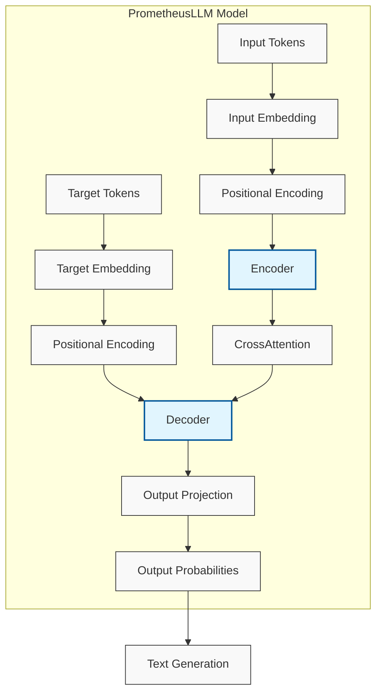
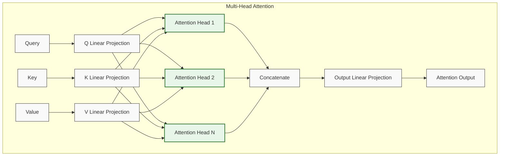
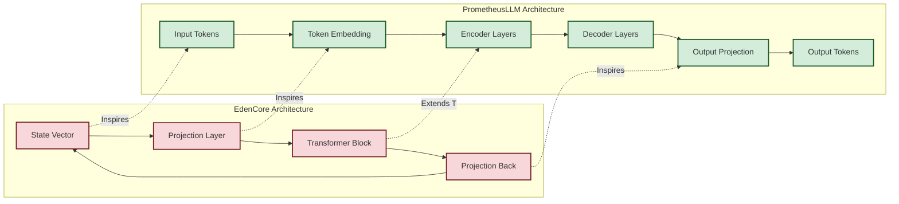

# PrometheusLLM Architecture Diagram

The following diagrams illustrate the architecture of the PrometheusLLM transformer model.

## Overall Architecture

## Encoder Architecture

```mermaid
graph TB
    subgraph "Encoder"
        EIn["Encoder Input"] --> EL1["Encoder Layer 1"]
        EL1 --> EL2["Encoder Layer 2"]
        EL2 --> ELN["..."]
        ELN --> ELast["Encoder Layer N"]
        ELast --> EOut["Encoder Output"]
    end
    
    subgraph "Encoder Layer"
        ELIn["Layer Input"] --> SelfAttn["Self-Attention"]
        SelfAttn --> AddNorm1["Add & Norm"]
        AddNorm1 --> FFN["Feed Forward Network"]
        FFN --> AddNorm2["Add & Norm"]
        AddNorm2 --> ELOut["Layer Output"]
    end
    
    classDef default fill:#f9f9f9,stroke:#333,stroke-width:1px;
    classDef highlight fill:#e1f5fe,stroke:#01579b,stroke-width:2px;
    class SelfAttn highlight
```

## Decoder Architecture

```mermaid
graph TB
    subgraph "Decoder"
        DIn["Decoder Input"] --> DL1["Decoder Layer 1"]
        DL1 --> DL2["Decoder Layer 2"]
        DL2 --> DLN["..."]
        DLN --> DLast["Decoder Layer N"]
        DLast --> DOut["Decoder Output"]
    end
    
    subgraph "Decoder Layer"
        DLIn["Layer Input"] --> MaskedSelfAttn["Masked Self-Attention"]
        MaskedSelfAttn --> AddNorm1["Add & Norm"]
        AddNorm1 --> CrossAttn["Cross-Attention"]
        CrossAttn --> AddNorm2["Add & Norm"]
        AddNorm2 --> FFN["Feed Forward Network"]
        FFN --> AddNorm3["Add & Norm"]
        AddNorm3 --> DLOut["Layer Output"]
    end
    
    classDef default fill:#f9f9f9,stroke:#333,stroke-width:1px;
    classDef highlight fill:#e1f5fe,stroke:#01579b,stroke-width:2px;
    class MaskedSelfAttn,CrossAttn highlight
```

## Multi-Head Attention Architecture

## Connection to EdenCore

